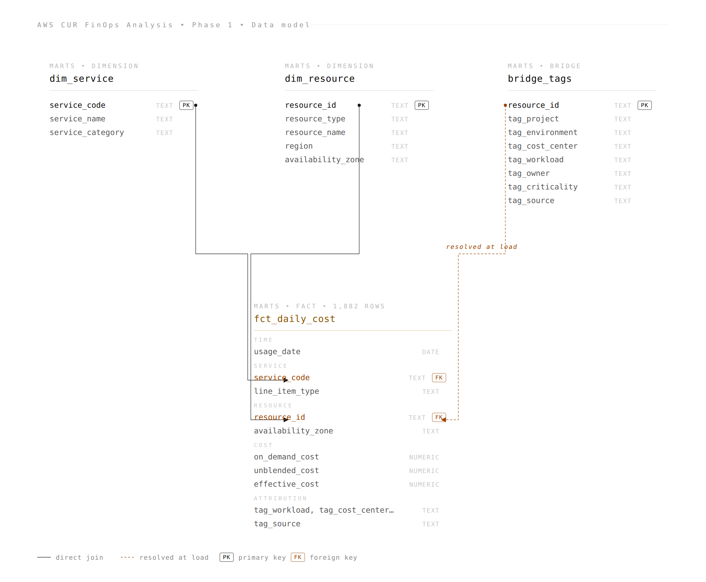

# 03 — Data model

## Star schema



One fact table at the centre, three dimensions hanging off it, no snowflaking. The bridge_tags join is shown as dashed because the relationship is **resolved at load time** rather than at query time — tag values are carried as columns on every fact row, with a `tag_source` column documenting whether each value came from a real resource tag or an inference rule. Analytical queries don't perform the bridge join themselves; they read the resolved tag columns directly.

## Architecture

```
Raw CUR (CSV in S3)
        │
        ▼
┌───────────────────────────────────────────────┐
│ schema: staging                               │
│   • cur_line_items                            │    
└───────────────────────────────────────────────┘
        │
        ▼
┌───────────────────────────────────────────────┐
│ schema: marts                                 │
│   • dim_service                               │   
│   • dim_resource                              │   
│   • bridge_tags                               │   
│   • fct_daily_cost                            │   
└───────────────────────────────────────────────┘
```

Two schemas, two purposes. **`staging`** is a faithful, typed copy of the CSV — column names match the CUR manifest exactly, no transformations applied. **`marts`** is where interpretation lives — the dimensions, the bridge, the fact table. This is the staging-and-marts pattern used by dbt and most modern data warehouses. We're not using dbt here (the stack is PostgreSQL + DBeaver only) but the folder structure mirrors dbt conventions for portability.

The contract between layers is simple: **anything in `staging` could be regenerated from raw CUR; anything in `marts` could be regenerated from `staging`.** Analytical queries always read from `marts` — never from `staging`.

## Each table, briefly

### `marts.dim_service` — 13 rows

One row per distinct `line_item_product_code`. Maps to a human-readable name and an editorial **`service_category`** column that groups services into FinOps-meaningful buckets (Compute, Network, Database, Storage, Observability, Security, Messaging, Analytics, Management).

The categorisation is opinionated. ELB and VPC both land in "Network" because in a 3-tier HA architecture they are the same concern: getting traffic from the internet to the application and back. A different team might separate them. The choice is documented in `01-dim-service.sql` and easy to change.

**Important caveat:** AWS bills the NAT gateway under the `AmazonEC2` service code, not `AmazonVPC`. Categorising on service code alone misclassifies NAT spend as Compute. The fact table preserves both the service code and the resource_id, so analytical queries that need the true network share can join through `dim_resource.resource_type` instead. This trap is detailed in [`04-findings.md`](04-findings.md).

### `marts.dim_resource` — 23 rows

One row per distinct `line_item_resource_id`. The interesting work is in the SQL: ARN parsing via `split_part()` and pattern matching with `LIKE` and regex, deriving readable names from the seven distinct identifier formats AWS uses.

Resource type is also derived from the identifier rather than maintained as a manual lookup, so the model degrades gracefully when new resource types appear in future CUR loads (they fall into `'Other'` and get flagged for triage).

### `marts.bridge_tags` — 23 rows

The architecturally interesting table, and the one most specific to CUR analysis. **Solves the problem that raw CUR tag coverage is rarely 100%.**

Three-tier attribution in priority order:

1. **`resource_tag`** — best-available real tags. Among all line items for the same resource, the one with the most populated tag keys wins.
2. **`inferred_partial`** — real tags + one or more keys filled in by a documented rule. Used for the NAT gateway, which has five of six tags but no `workload` (it's shared infrastructure, doesn't belong to a single tier).
3. **`inferred_full`** — all values inferred from resource type. Used for ENIs (Public IPv4 charges), EBS volumes, and the CloudTrail S3 bucket — resources with no real tags anywhere in the CUR.

A `tag_source` column on every row documents the provenance. **A finance team using this for showback can always see whether a number came from a real resource tag or an inference rule.** That transparency is what makes the attribution defensible.

Lines with no `resource_id` (CloudWatch dashboards, KMS API calls, free-tier CloudTrail event records) are not in the bridge — there is nothing to key on. They are attributed inline in `fct_daily_cost` via a CASE on `line_item_product_code` and recorded with `tag_source = 'usage_type_inferred'`.

### `marts.fct_daily_cost` — 1,882 rows

The central table every analysis query reads from. Row grain: **one CUR line item.** Not pre-aggregated to daily, because aggregation embeds assumptions about line_item_type filtering that are hard to undo. Aggregation lives in queries, where it is visible and revisable.

Columns:

- Time: `usage_date` (DATE, derived from `line_item_usage_start_date` in UTC)
- Service: `service_code`, `usage_type`, `line_item_description`, `line_item_type`
- Resource: `resource_id`, `availability_zone`, `region`
- Cost: `on_demand_cost`, `unblended_cost`, `effective_cost` — three variants for three different questions
- Usage: `usage_amount`, `usage_unit`
- Tags: six dimensions resolved via COALESCE — bridge first, inline CASE for null-resource rows
- Provenance: `tag_source`

## Why three cost columns

| Column | Use when |
|---|---|
| `on_demand_cost` | Comparing resources at economic value, forecasting, unit economics. **Default for analysis.** |
| `unblended_cost` | Invoice reconciliation. Includes Credit rows as negative numbers. |
| `effective_cost` | Net of credits and discounts where populated. Currently equals `unblended_cost` in this dataset because `line_item_net_unblended_cost` is NULL. Included for portability to accounts where the column is populated. |

A single "cost" column would force every analysis query to remember which variant is the right one for the question being asked. Carrying all three makes the choice explicit at query time.

## Indexing

Four indexes on `fct_daily_cost` cover the main query patterns:

- `(usage_date, service_code)` — composite, for time-series + service-breakdown queries
- `(resource_id) WHERE resource_id IS NOT NULL` — partial, for per-resource diagnostic queries
- `(tag_workload)` — for showback queries that group by tier
- `(usage_date) WHERE line_item_type = 'Usage'` — partial, for the most common cost query filter

**Honest scale note: at 1,882 rows none of these indexes meaningfully improves query performance.** Postgres sequential-scans the table faster than it can use most indexes. The indexes are present to demonstrate correct indexing decisions for a production-scale CUR (50M+ rows/month is normal in enterprise accounts) and to make `EXPLAIN` plans more readable when the project is run against larger samples.

## Why no partitioning

Partitioning the fact table by `bill_billing_period_start_date` is a worthwhile optimisation when (a) the table holds tens of millions of rows or more, and (b) queries reliably filter on the partition key. At 1,882 rows in a single billing period, partitioning would add DDL complexity for zero query-time benefit.

The threshold for revisiting the decision is roughly 5M rows or 12+ months of CUR history loaded into the same table. The standard pattern at that point is `PARTITION BY RANGE (bill_billing_period_start_date)` with one partition per calendar month. Sketch:

```sql
-- Sketch only — do not run on this dataset
CREATE TABLE marts.fct_daily_cost (
    -- columns
) PARTITION BY RANGE (usage_date);

CREATE TABLE marts.fct_daily_cost_2026_04
  PARTITION OF marts.fct_daily_cost
  FOR VALUES FROM ('2026-04-01') TO ('2026-05-01');
```

## Refresh cadence

When a new month's CUR arrives:

1. Truncate `staging.cur_line_items` and reload it from the new CSV.
2. Re-run `sql/20-marts/` in order. Each file drops and recreates its table — idempotent.
3. If the new file introduces a service code not in `dim_service`, the verification block in `01-dim-service.sql` raises a warning. The CASE statement is updated and the marts are rebuilt.

This is a full-refresh pattern. For a production pipeline handling hundreds of millions of rows across many months, the truncate would be scoped to the incoming billing period only and partitioning would handle the physical isolation. The logic is identical, just scoped by partition key rather than the whole table.
